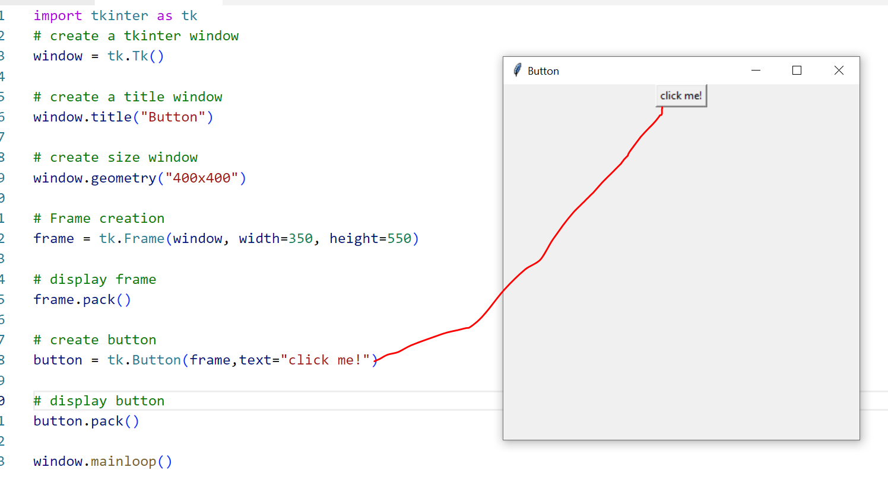
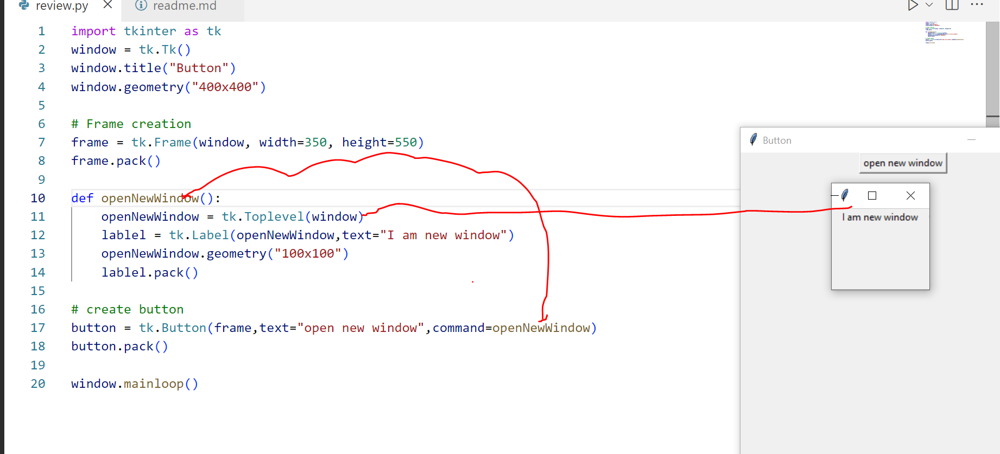
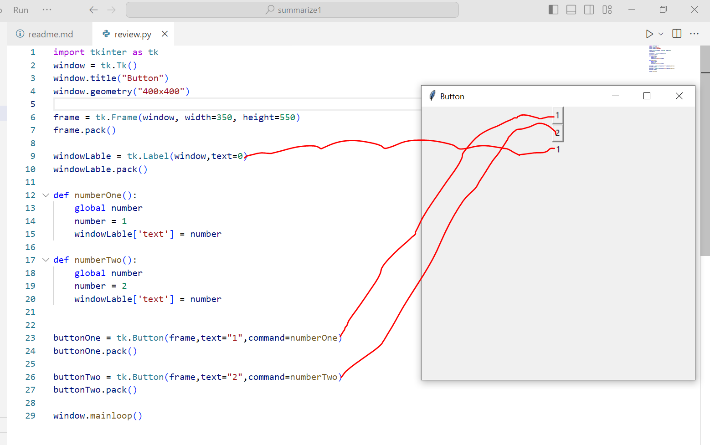
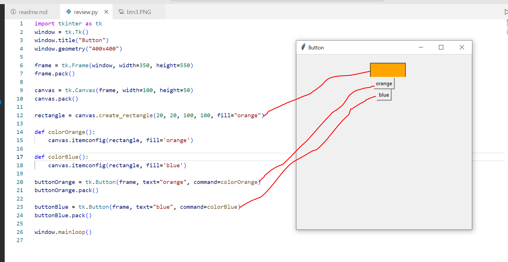

## Tkinter basic note BUTTON tkinter

#### Create button in frame
```python
import tkinter as tk
# create a tkinter window
window = tk.Tk()

# create a title window
window.title("Button")

# create size window
window.geometry("400x400")

# Frame creation
frame = tk.Frame(window, width=350, height=550)

# display frame
frame.pack()

# create button
button = tk.Button(frame,text="click me!")

# display button
button.pack()

window.mainloop()
```

#### Examples:



#### Open a new window using button

```python
import tkinter as tk
window = tk.Tk()
window.title("Button")
window.geometry("400x400")

# Frame creation
frame = tk.Frame(window, width=350, height=550)
frame.pack()

# create function to open new window
def openNewWindow():
    openNewWindow = tk.Toplevel(window)
    lablel = tk.Label(openNewWindow,text="I am new window")
    openNewWindow.geometry("100x100")
    lablel.pack()

# create button
button = tk.Button(frame,text="open new window",command=openNewWindow)
button.pack()

window.mainloop()
```

#### Examples:



#### Change value using button

```python
import tkinter as tk
window = tk.Tk()
window.title("Button")
window.geometry("400x400")

frame = tk.Frame(window, width=350, height=550)
frame.pack()

windowLable = tk.Label(window,text=0)
windowLable.pack()

def numberOne():
    global number
    number = 1
    windowLable['text'] = number

def numberTwo():
    global number
    number = 2
    windowLable['text'] = number


buttonOne = tk.Button(frame,text="1",command=numberOne)
buttonOne.pack()

buttonTwo = tk.Button(frame,text="2",command=numberTwo)
buttonTwo.pack()

window.mainloop()
```

#### Examples:



#### How to change the color of a Tkinter rectangle on clicking

```python
import tkinter as tk
window = tk.Tk()
window.title("Button")
window.geometry("400x400")

frame = tk.Frame(window, width=350, height=550)
frame.pack()

canvas = tk.Canvas(frame, width=100, height=50)
canvas.pack()

rectangle = canvas.create_rectangle(20, 20, 100, 100, fill="orange")

def colorOrange():
    canvas.itemconfig(rectangle, fill='orange')

def colorBlue():
    canvas.itemconfig(rectangle, fill='blue')

buttonOrange = tk.Button(frame, text="orange", command=colorOrange)
buttonOrange.pack()

buttonBlue = tk.Button(frame, text="blue", command=colorBlue)
buttonBlue.pack()

window.mainloop()
```

#### Examples:

